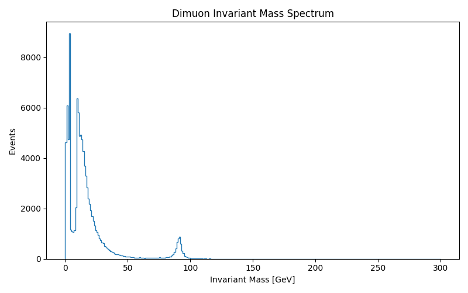
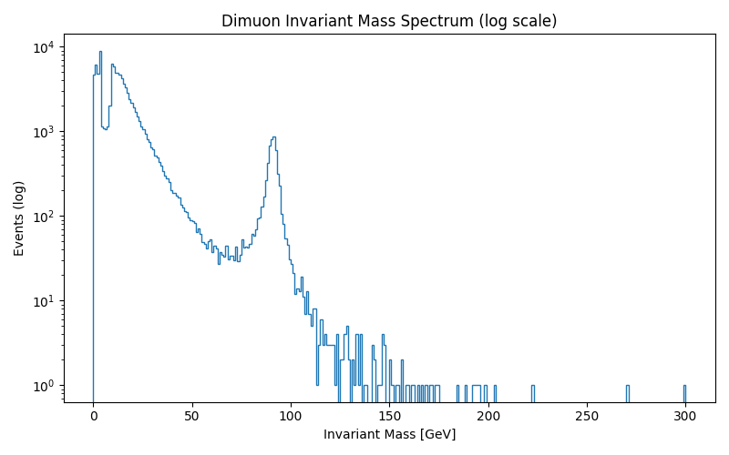
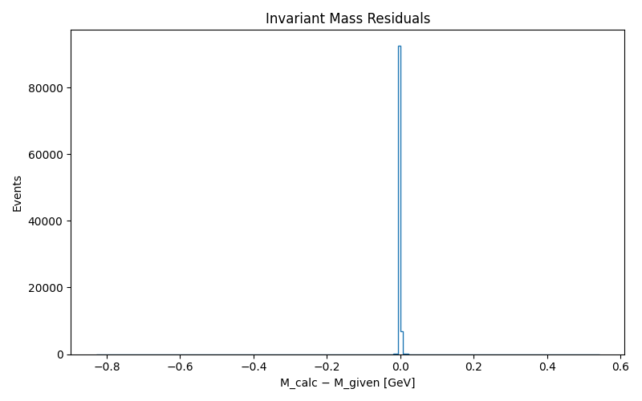
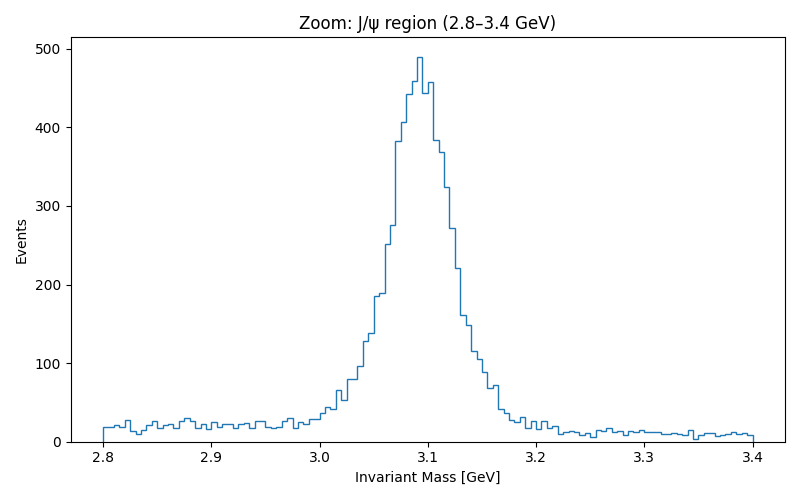
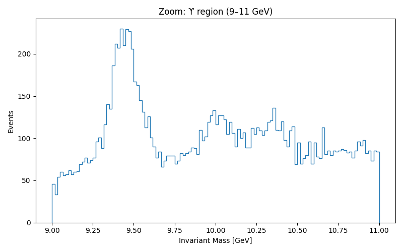
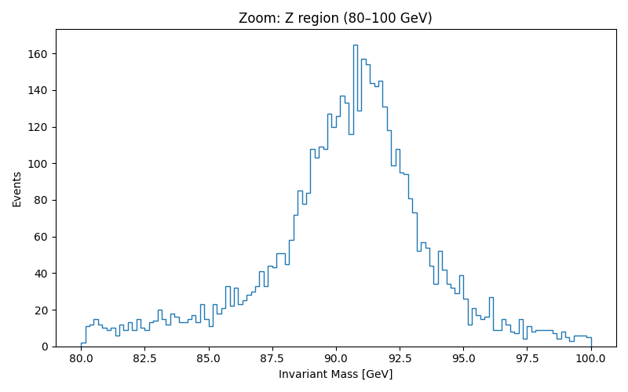

# Chapter 1 — Dimuon Invariant Mass

_Generated on 2025-12-15T05:07:11.948840 UTC_

## Summary

- Events analyzed: **100000**
- Residual RMS between reconstructed and provided invariant mass: **4.036e-03 GeV**

This residual confirms internal consistency of the kinematic reconstruction and validates the invariant mass calculation as a stable global quantity.

## Figures

## Interpretation

This chapter starts from the most elementary experimental object available in collider data, the event. Each event consists only of detector measurements that are local in space and time. In a dimuon event, the detector records two charged tracks that are identified as muons based on their penetration depth, curvature in a magnetic field, and timing consistency. At this level there is no notion of a parent particle, resonance, or mass peak. There are only two reconstructed muons.

Momentum is inferred geometrically from track curvature in a known magnetic field, while energy is computed from momentum using a fixed muon mass hypothesis through the relativistic energy momentum relation. Energy and momentum are therefore not primitive observables but reconstructed quantities derived from spacetime measurements under a physical model. The muon itself is treated as a particle level primitive in this analysis, in the sense that it is identified event by event and not statistically inferred.

Invariant mass enters only after combining the reconstructed four vectors of the two muons. For a single event, the invariant mass has no special meaning beyond being one number among many possible kinematic combinations. The crucial observation is that no individual event contains a particle in the everyday sense. What we conventionally call particles such as J/ψ, ϒ or Z do not appear in any single collision record.

Only after aggregating many events does structure emerge. When invariant mass is computed consistently across a large ensemble, the distribution develops sharp peaks at specific values. These peaks are not objects traveling through the detector. They are stable statistical structures that arise from Lorentz invariant constraints applied repeatedly across many independent events. The parent particle is therefore not an event level entity but a model level construct that emerges from aggregation.

This asymmetry is central to the interpretation. The muon is assumed as a particle because its behavior is validated locally and repeatedly at the detector level. The heavier resonances are not assumed. They are inferred statistically and only exist as peaks in invariant mass space. In this sense, the experiment distinguishes between detector primitives and model emergent structures.

Mass plays a special role in this process. It does not behave like a substance carried by an object, nor like a quantized excitation level. Instead, mass appears as a global constraint that links energy and momentum across reference frames. In relativistic terms, mass is the invariant quantity that remains fixed when energy and momentum vary. In frequency language, it defines a dispersion constraint that restricts which combinations of frequency and wave vector are allowed.

Assuming the correct muon mass leads to global coherence across events, as reflected in the small residual between reconstructed and provided invariant mass. Assuming an incorrect mass would not break individual events in any dramatic way, but it would destroy statistical consistency across the ensemble. In this sense, the mass value is not imposed arbitrarily but validated by the requirement of collective self consistency.

Quantization does not appear directly in this chapter. No observable here is quantized in the sense of arising from an operator spectrum or boundary condition. The discreteness that appears in the invariant mass spectrum is a discreteness of model space, not of spacetime itself. It reflects the existence of distinct fields with distinct dispersion constraints, not excitation levels of a single system.

From this perspective, quantization lives at the boundary between continuous spacetime data and global spectral representation, where consistency conditions produce eigenvalues. Discreteness, by contrast, can exist entirely within the model as a classification of stable structures. The dimuon invariant mass spectrum illustrates this distinction clearly.

The core result of Chapter 1 is therefore not the rediscovery of known resonances, but the demonstration that what we call particles can be understood as stable statistical attractors in invariant kinematic space. The experiment shows how models emerge from events, not the other way around. This establishes the conceptual foundation for the chapters that follow.